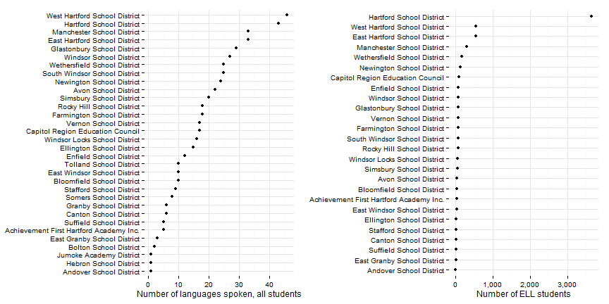
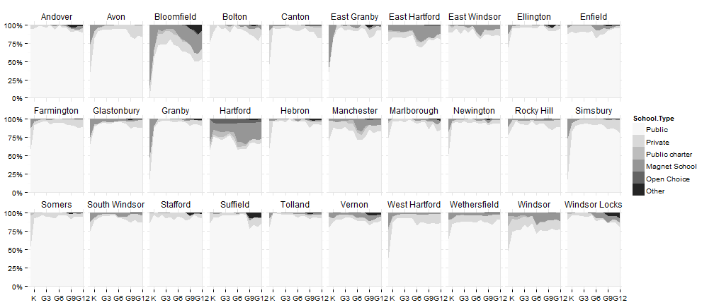
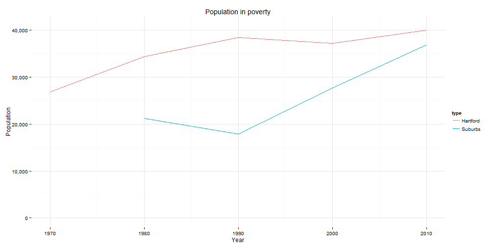

## Who are we: nativity

Source: [Census](http://factfinder2.census.gov/faces/tableservices/jsf/pages/productview.xhtml?pid=ACS_12_1YR_DP02&prodType=table); availability: most recent 2007-2011; breakouts: ancestry or place of birth.

--- 
## Who are we: languages in school

Source: [SDE](http://sdeportal.ct.gov/Cedar/WEB/ct_report/EllDT.aspx); availability: 2000-01 - 2010-11; breakouts: none.

--- 
## Who are we: school enrollment

Source: [SDE](http://sdeportal.ct.gov/Cedar/WEB/ct_report/EnrollmentDT.aspx); availability: 2006-07 - 2010-11; breakouts: type of school

--- 
## Who are we: commuting patterns

Source: [Census / DoL](http://onthemap.ces.census.gov/); availability: 2002 - 2011; breakouts: age, income, sector

--- 
## Who are we: poverty and income

Source: [Census](http://factfinder2.census.gov/); availability: most recent 2007-2011; breakouts: age, gender, race / ethnicity, commuting, others

 

--- 
## Education: 3rd grade reading

Source: [SDE](http://sdeportal.ct.gov/Cedar/WEB/ct_report/CMTLandingDT.aspx); availability: 2005-06 - 2010-2011; breakouts: ELL, special-education status, gender, race / ethnicity, free / reduced-price lunch eligibility

 

--- 
## Education: chronic absenteeism

Source: [SDE](http://sdeportal.ct.gov/Cedar/); availability: 2012; breakouts: ELL, special-education status, gender, race / ethnicity, free / reduced-price lunch eligibility

 

--- 
## Education: high-school graduation

Source: [SDE](http://sdeportal.ct.gov/Cedar/WEB/ResearchandReports/DataBulletins.aspx); availability: 2010-11; breakouts: ELL, special-education status, gender, race / ethnicity, free / reduced-price lunch eligibility

 

--- 
## Economy: educational attainment

Source: [Census](http://factfinder2.census.gov/); availability: most recent 2007-2011; breakouts: age, gender, race / ethnicity, commuting, others

 

--- 
## Economy: unemployment and labor force participation

Sources: [ACS](http://factfinder2.census.gov/faces/tableservices/jsf/pages/productview.xhtml?pid=ACS_11_5YR_B23025&prodType=table), [BLS](http://www1.ctdol.state.ct.us/lmi/LAUS/default.asp); ACS: most recent 2007-11; BLS: 1994 - 2013; breakouts: age, gender, race / ethnicity, nativity, commuting, others (ACS only).

 

--- 
## Quality of life: home ownership

Source: [Census](http://factfinder2.census.gov/faces/tableservices/jsf/pages/productview.xhtml?pid=ACS_11_5YR_B25008&prodType=table); availability: most recent 2007-2011; breakouts: age, gender, race / ethnicity, others

 

--- 
## Quality of life: crime

Source: [Dept. of Public Safety](http://www.dpsdata.ct.gov/dps/ucr/ucr.aspx); availability: 2001-10; breakouts: property / violent, type of crime

 

--- 
## Quality of life: voter turnout / registration

Workin' on it.

