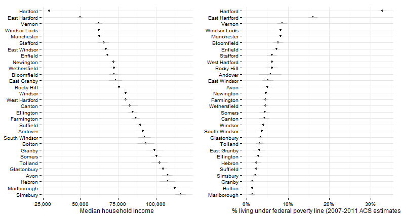
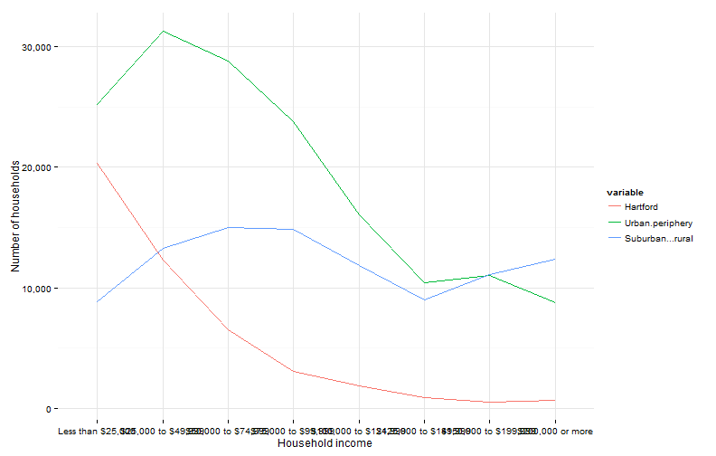
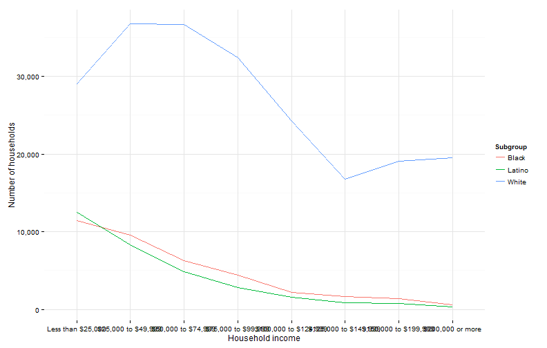
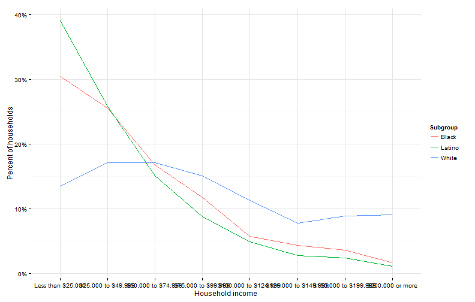
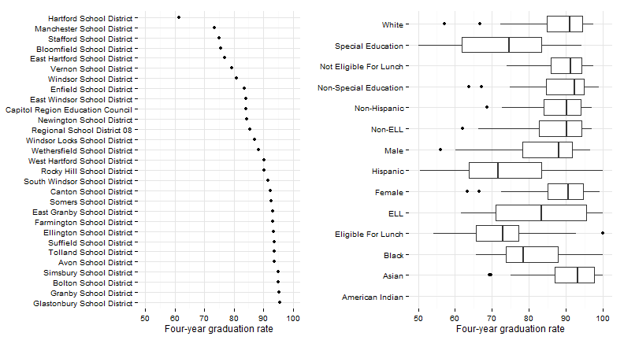
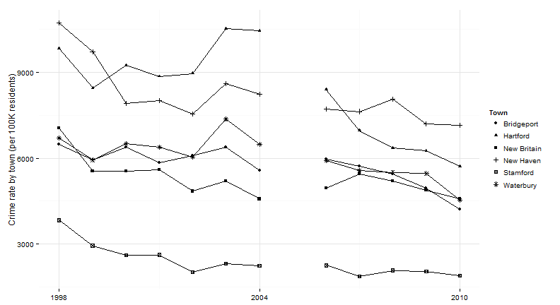
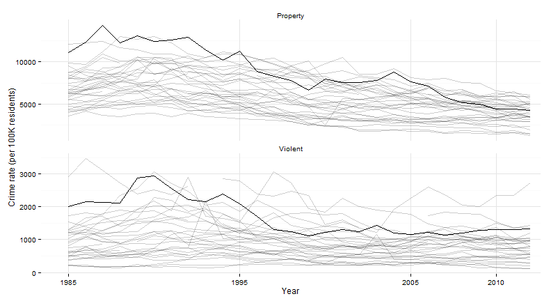
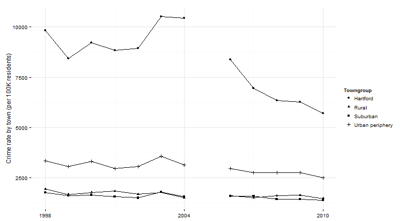
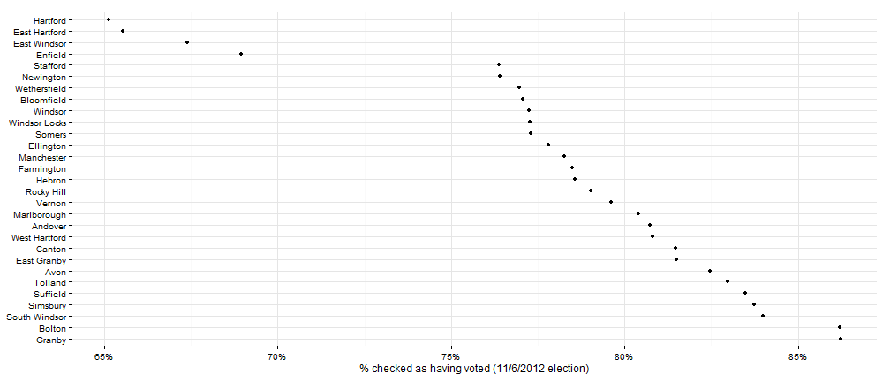

## Who are we: Population and immigration

Source: [UConn State Data Center](http://ctsdc.uconn.edu/projections.html). Availability: 1900 - 2025 (2015 - 2025 projections). 


 
 

<div id = 'chart1' class = 'rChart nvd3'></div>
<script type='text/javascript'>
 $(document).ready(function(){
      drawchart1()
    });
    function drawchart1(){  
      var opts = {
 "dom": "chart1",
"width":    700,
"height":    425,
"x": "period",
"y": "sumpop",
"group": "Towngroup",
"type": "lineChart",
"id": "chart1" 
},
        data = [
 {
 "period": 1900,
"Towngroup": "Hartford",
"sumpop": 79850,
"sumpoor": null 
},
{
 "period": 1900,
"Towngroup": "Rural",
"sumpop": 5136,
"sumpoor": null 
},
{
 "period": 1900,
"Towngroup": "Suburban",
"sumpop": 30970,
"sumpoor": null 
},
{
 "period": 1900,
"Towngroup": "Urban periphery",
"sumpop": 43141,
"sumpoor": null 
},
{
 "period": 1910,
"Towngroup": "Hartford",
"sumpop": 98915,
"sumpoor": null 
},
{
 "period": 1910,
"Towngroup": "Rural",
"sumpop": 5386,
"sumpoor": null 
},
{
 "period": 1910,
"Towngroup": "Suburban",
"sumpop": 33905,
"sumpoor": null 
},
{
 "period": 1910,
"Towngroup": "Urban periphery",
"sumpop": 55132,
"sumpoor": null 
},
{
 "period": 1920,
"Towngroup": "Hartford",
"sumpop": 138036,
"sumpoor": null 
},
{
 "period": 1920,
"Towngroup": "Rural",
"sumpop": 5803,
"sumpoor": null 
},
{
 "period": 1920,
"Towngroup": "Suburban",
"sumpop": 38294,
"sumpoor": null 
},
{
 "period": 1920,
"Towngroup": "Urban periphery",
"sumpop": 71399,
"sumpoor": null 
},
{
 "period": 1930,
"Towngroup": "Hartford",
"sumpop": 164072,
"sumpoor": null 
},
{
 "period": 1930,
"Towngroup": "Rural",
"sumpop": 6162,
"sumpoor": null 
},
{
 "period": 1930,
"Towngroup": "Suburban",
"sumpop": 43919,
"sumpoor": null 
},
{
 "period": 1930,
"Towngroup": "Urban periphery",
"sumpop": 104324,
"sumpoor": null 
},
{
 "period": 1940,
"Towngroup": "Hartford",
"sumpop": 166267,
"sumpoor": null 
},
{
 "period": 1940,
"Towngroup": "Rural",
"sumpop": 6641,
"sumpoor": null 
},
{
 "period": 1940,
"Towngroup": "Suburban",
"sumpop": 51271,
"sumpoor": null 
},
{
 "period": 1940,
"Towngroup": "Urban periphery",
"sumpop": 120848,
"sumpoor": null 
},
{
 "period": 1950,
"Towngroup": "Hartford",
"sumpop": 177397,
"sumpoor": null 
},
{
 "period": 1950,
"Towngroup": "Rural",
"sumpop": 8524,
"sumpoor": null 
},
{
 "period": 1950,
"Towngroup": "Suburban",
"sumpop": 66268,
"sumpoor": null 
},
{
 "period": 1950,
"Towngroup": "Urban periphery",
"sumpop": 166002,
"sumpoor": null 
},
{
 "period": 1960,
"Towngroup": "Hartford",
"sumpop": 162178,
"sumpoor": null 
},
{
 "period": 1960,
"Towngroup": "Rural",
"sumpop": 12973,
"sumpoor": null 
},
{
 "period": 1960,
"Towngroup": "Suburban",
"sumpop": 117468,
"sumpoor": null 
},
{
 "period": 1960,
"Towngroup": "Urban periphery",
"sumpop": 253926,
"sumpoor": null 
},
{
 "period": 1970,
"Towngroup": "Hartford",
"sumpop": 158017,
"sumpoor":          26863 
},
{
 "period": 1970,
"Towngroup": "Rural",
"sumpop": 17505,
"sumpoor": null 
},
{
 "period": 1970,
"Towngroup": "Suburban",
"sumpop": 168469,
"sumpoor": null 
},
{
 "period": 1970,
"Towngroup": "Urban periphery",
"sumpop": 325916,
"sumpoor": null 
},
{
 "period": 1980,
"Towngroup": "Hartford",
"sumpop": 136392,
"sumpoor":          34371 
},
{
 "period": 1980,
"Towngroup": "Rural",
"sumpop": 19542,
"sumpoor":           1219 
},
{
 "period": 1980,
"Towngroup": "Suburban",
"sumpop": 196648,
"sumpoor":           5675 
},
{
 "period": 1980,
"Towngroup": "Urban periphery",
"sumpop": 315897,
"sumpoor":          14358 
},
{
 "period": 1990,
"Towngroup": "Hartford",
"sumpop": 139739,
"sumpoor":          38428 
},
{
 "period": 1990,
"Towngroup": "Rural",
"sumpop": 21729,
"sumpoor":            705 
},
{
 "period": 1990,
"Towngroup": "Suburban",
"sumpop": 226612,
"sumpoor":           5341 
},
{
 "period": 1990,
"Towngroup": "Urban periphery",
"sumpop": 321324,
"sumpoor":          11873 
},
{
 "period": 2000,
"Towngroup": "Hartford",
"sumpop": 121578,
"sumpoor":          37203 
},
{
 "period": 2000,
"Towngroup": "Rural",
"sumpop": 23271,
"sumpoor":            958 
},
{
 "period": 2000,
"Towngroup": "Suburban",
"sumpop": 249706,
"sumpoor":           7736 
},
{
 "period": 2000,
"Towngroup": "Urban periphery",
"sumpop": 326765,
"sumpoor":          19044 
},
{
 "period": 2010,
"Towngroup": "Hartford",
"sumpop": 124775,
"sumpoor":          40053 
},
{
 "period": 2010,
"Towngroup": "Rural",
"sumpop": 25909,
"sumpoor":           1205 
},
{
 "period": 2010,
"Towngroup": "Suburban",
"sumpop": 270796,
"sumpoor":           9245 
},
{
 "period": 2010,
"Towngroup": "Urban periphery",
"sumpop": 336031,
"sumpoor":          26451 
},
{
 "period": 2015,
"Towngroup": "Hartford",
"sumpop": 125999,
"sumpoor": null 
},
{
 "period": 2015,
"Towngroup": "Rural",
"sumpop": 38388,
"sumpoor": null 
},
{
 "period": 2015,
"Towngroup": "Suburban",
"sumpop": 277497,
"sumpoor": null 
},
{
 "period": 2015,
"Towngroup": "Urban periphery",
"sumpop": 341742,
"sumpoor": null 
},
{
 "period": 2020,
"Towngroup": "Hartford",
"sumpop": 126656,
"sumpoor": null 
},
{
 "period": 2020,
"Towngroup": "Rural",
"sumpop": 38911,
"sumpoor": null 
},
{
 "period": 2020,
"Towngroup": "Suburban",
"sumpop": 282476,
"sumpoor": null 
},
{
 "period": 2020,
"Towngroup": "Urban periphery",
"sumpop": 346788,
"sumpoor": null 
},
{
 "period": 2025,
"Towngroup": "Hartford",
"sumpop": 126185,
"sumpoor": null 
},
{
 "period": 2025,
"Towngroup": "Rural",
"sumpop": 39463,
"sumpoor": null 
},
{
 "period": 2025,
"Towngroup": "Suburban",
"sumpop": 286373,
"sumpoor": null 
},
{
 "period": 2025,
"Towngroup": "Urban periphery",
"sumpop": 350406,
"sumpoor": null 
} 
]
  
      if(!(opts.type==="pieChart" || opts.type==="sparklinePlus")) {
        var data = d3.nest()
          .key(function(d){
            //return opts.group === undefined ? 'main' : d[opts.group]
            //instead of main would think a better default is opts.x
            return opts.group === undefined ? opts.y : d[opts.group];
          })
          .entries(data);
      }
      
      nv.addGraph(function() {
        var chart = nv.models[opts.type]()
          .x(function(d) { return d[opts.x] })
          .y(function(d) { return d[opts.y] })
          .width(opts.width)
          .height(opts.height)
         
        chart
  .forceY([      0, 3.5e+05 ])
          
        chart.xAxis
  .axisLabel("Year")

        
        
        chart.yAxis
  .tickFormat(function(d) {return d3.format(',.0f')(d)})
  .axisLabel("Population")
      
       d3.select("#" + opts.id)
        .append('svg')
        .datum(data)
        .transition().duration(500)
        .call(chart);

       nv.utils.windowResize(chart.update);
       return chart;
      });
    };
</script>


---
## Who are we: Population and immigration

Source: [UConn State Data Center](http://ctsdc.uconn.edu/projections.html). Availability: 1900 - 2025 (2015 - 2025 projections). 

 

```
Error: non-numeric argument to binary operator
```

---

## Who are we: Population and immigration

Source: [Refugee Processing Center](http://www.wrapsnet.org/). Availability: 2002 - present. 

 


--- 
## Who are we: languages in school

Source: [SDE](http://sdeportal.ct.gov/Cedar/WEB/ct_report/EllDT.aspx); availability: 2000-01 - 2010-11; breakouts: none.

 


--- 
## Who are we: school enrollment

Source: [SDE](http://sdeportal.ct.gov/Cedar/WEB/ct_report/EnrollmentDT.aspx); availability: 2006-07 - 2010-11; breakouts: type of school

 


--- 
## Who are we: commuting patterns

Source: [Census / DoL](http://onthemap.ces.census.gov/); availability: 2002 - 2011; breakouts: age, income, sector


--- 
## Who are we: poverty and income

Source: [Census](http://factfinder2.census.gov/); availability: most recent 2007-2011; breakouts: age, gender, race / ethnicity, commuting, others

 


--- 
## Who are we: poverty and income (2)

Source: [Census](http://factfinder2.census.gov/faces/tableservices/jsf/pages/productview.xhtml?pid=ACS_11_5YR_B19001&prodType=table); availability: most recent 2007-2011; breakouts: gender, race / ethnicity, others

 


--- 
## Who are we: Regional poverty

Source: [Census](http://factfinder2.census.gov/faces/tableservices/jsf/pages/productview.xhtml?pid=ACS_11_5YR_B19001&prodType=table); availability: 1970 - 2012

 


--- 
## Who are we: Regional poverty

Source: [Census](http://factfinder2.census.gov/faces/tableservices/jsf/pages/productview.xhtml?pid=ACS_11_5YR_B19001&prodType=table); availability: 1970 - 2012

 


--- 
## Who are we: poverty and income (3)

Source: [Census](http://factfinder2.census.gov/faces/tableservices/jsf/pages/productview.xhtml?pid=ACS_11_5YR_B19001&prodType=table); availability: most recent 2007-2011; breakouts: gender, race / ethnicity, others

 


--- 
## Who are we: poverty and income (4)

Source: [Census](http://factfinder2.census.gov/faces/tableservices/jsf/pages/productview.xhtml?pid=ACS_11_5YR_B19001&prodType=table); availability: most recent 2007-2011; breakouts: gender, race / ethnicity, others

 


--- 
## Who are we: poverty and income (5)

Source: [Census](http://factfinder2.census.gov/faces/tableservices/jsf/pages/productview.xhtml?pid=ACS_11_5YR_B19001&prodType=table); availability: most recent 2007-2011; breakouts: gender, race / ethnicity, others

 


--- 
## Who we are: income (by neighborhood)

Source: [Census](http://factfinder2.census.gov/faces/tableservices/jsf/pages/productview.xhtml?pid=ACS_11_5YR_B19001&prodType=table).

 


--- 
## Education: 3rd grade reading

Source: [SDE](http://sdeportal.ct.gov/Cedar/WEB/ct_report/CMTLandingDT.aspx); availability: 2005-06 - 2010-2011.

 

--- 
## Education: chronic absenteeism

Source: [SDE](http://sdeportal.ct.gov/Cedar/); availability: 2012.

 

--- 
## Education: high-school graduation

Source: [SDE](http://sdeportal.ct.gov/Cedar/WEB/ResearchandReports/DataBulletins.aspx); availability: 2010-11.

 

--- 
## Economy: educational attainment

Source: [Census](http://factfinder2.census.gov/); availability: most recent 2008-2012.

 


--- 
## Economy: educational attainment (totals)

Source: [Census](http://factfinder2.census.gov/); availability: most recent 2008-2012.

 


--- 
## Economy: educational attainment by race

Source: [Census](http://factfinder2.census.gov/); most recent: 2008 - 2012.

 


--- 
## Economy: workforce and unemployment

Sources: [ACS](http://factfinder2.census.gov/faces/tableservices/jsf/pages/productview.xhtml?pid=ACS_11_5YR_B23025&prodType=table)breakouts: age, gender, race / ethnicity, nativity, commuting, others.

 


--- 
## Economy: unemployment by race

Sources: [ACS](http://factfinder2.census.gov/faces/tableservices/jsf/pages/productview.xhtml?pid=ACS_11_5YR_B23025&prodType=table). 

 


--- 
## Quality of life: home ownership (by town)

Source: [Census](http://factfinder2.census.gov/faces/tableservices/jsf/pages/productview.xhtml?pid=ACS_11_5YR_B25008&prodType=table); availability: most recent 2008-2012.

 


--- 
## Quality of life: home ownership (by neighborhood)

Source: [Census](http://factfinder2.census.gov/faces/tableservices/jsf/pages/productview.xhtml?pid=ACS_11_5YR_B25008&prodType=table).

 


--- 
## Quality of life: home ownership (by race)

Source: [Census](http://factfinder2.census.gov/faces/tableservices/jsf/pages/productview.xhtml?pid=ACS_11_5YR_B25008&prodType=table).

 


--- 
## Quality of life: housing and transit cost

Source: [Location Affordability Index](http://lai.locationaffordability.info/).

 


--- 
## Quality of life: crime (major CT towns)

Source: [Dept. of Public Safety](http://www.dpsdata.ct.gov/dps/ucr/ucr.aspx); availability: 2001-10; breakouts: property / violent, type of crime

 

--- 
## Quality of life: crime (comparison)

Source: [FBI](http://www.ucrdatatool.gov/); availability: 1985-2012; breakouts: property / violent, type of crime

 

--- 

## Quality of life: crime (within region)

Source: [Dept. of Public Safety](http://www.dpsdata.ct.gov/dps/ucr/ucr.aspx); availability: 2001-10; breakouts: property / violent, type of crime

 

--- 
## Quality of life: voter turnout

Source: [CT Secretary of State](http://www.ct.gov/sots/cwp/view.asp?a=3179&q=392194)

 


--- 
## Quality of life: voter turnout

Source: [HartfordInfo](http://hartfordinfo.org/).

 

