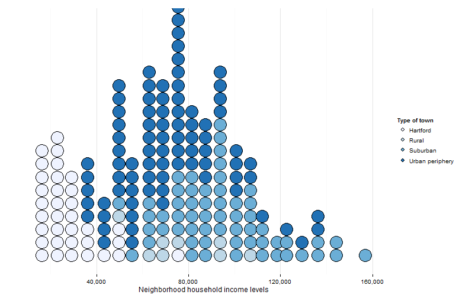
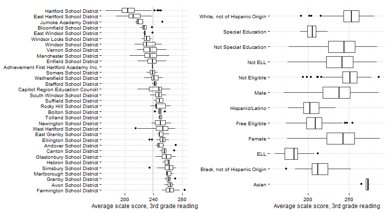
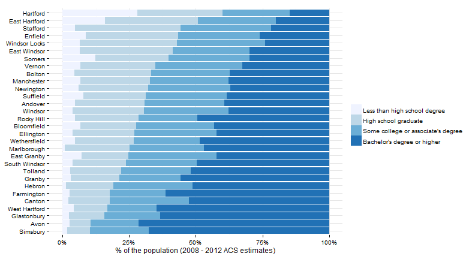
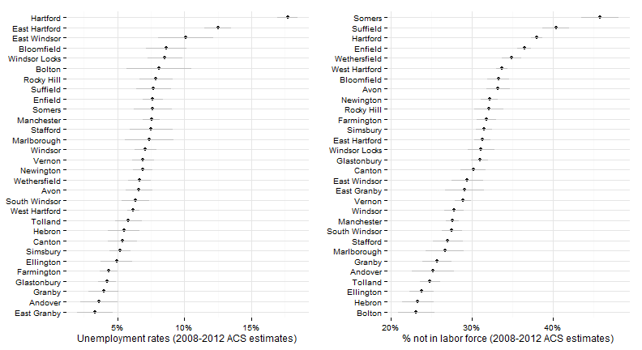
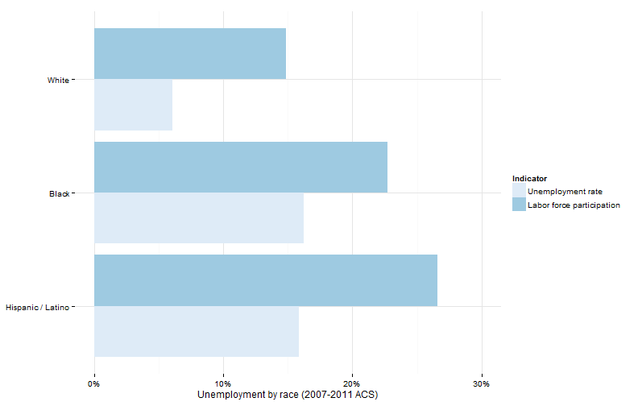
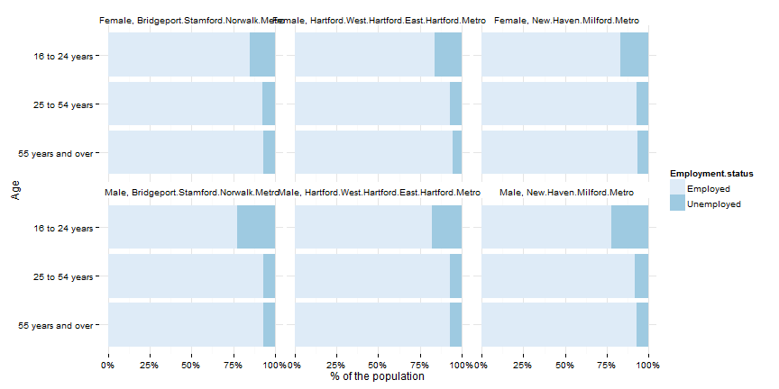
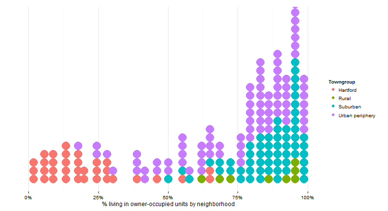

## Who are we: Population and immigration

Source: [Refugee Processing Center](http://www.wrapsnet.org/). Availability: 2002 - present. 

 

--- 
## Who are we: languages in school

Source: [SDE](http://sdeportal.ct.gov/Cedar/WEB/ct_report/EllDT.aspx); availability: 2000-01 - 2010-11; breakouts: none.

 

--- 
## Who are we: school enrollment

Source: [SDE](http://sdeportal.ct.gov/Cedar/WEB/ct_report/EnrollmentDT.aspx); availability: 2006-07 - 2010-11; breakouts: type of school

 

--- 
## Who are we: commuting patterns

Source: [Census / DoL](http://onthemap.ces.census.gov/); availability: 2002 - 2011; breakouts: age, income, sector

--- 
## Who are we: poverty and income

Source: [Census](http://factfinder2.census.gov/); availability: most recent 2007-2011; breakouts: age, gender, race / ethnicity, commuting, others

 

--- 
## Who are we: poverty and income (2)

Source: [Census](http://factfinder2.census.gov/faces/tableservices/jsf/pages/productview.xhtml?pid=ACS_11_5YR_B19001&prodType=table); availability: most recent 2007-2011; breakouts: gender, race / ethnicity, others

 

--- 
## Who are we: Regional poverty

Source: [Census](http://factfinder2.census.gov/faces/tableservices/jsf/pages/productview.xhtml?pid=ACS_11_5YR_B19001&prodType=table); availability: 1970 - 2012

 

--- 
## Who are we: poverty and income (3)

Source: [Census](http://factfinder2.census.gov/faces/tableservices/jsf/pages/productview.xhtml?pid=ACS_11_5YR_B19001&prodType=table); availability: most recent 2007-2011; breakouts: gender, race / ethnicity, others

 

--- 
## Who are we: poverty and income (4)

Source: [Census](http://factfinder2.census.gov/faces/tableservices/jsf/pages/productview.xhtml?pid=ACS_11_5YR_B19001&prodType=table); availability: most recent 2007-2011; breakouts: gender, race / ethnicity, others

 

--- 
## Who are we: poverty and income (5)

Source: [Census](http://factfinder2.census.gov/faces/tableservices/jsf/pages/productview.xhtml?pid=ACS_11_5YR_B19001&prodType=table); availability: most recent 2007-2011; breakouts: gender, race / ethnicity, others

 

--- 
## Who we are: income (by neighborhood)

Source: [Census](http://factfinder2.census.gov/faces/tableservices/jsf/pages/productview.xhtml?pid=ACS_11_5YR_B19001&prodType=table).

 

--- 
## Education: 3rd grade reading

Source: [SDE](http://sdeportal.ct.gov/Cedar/WEB/ct_report/CMTLandingDT.aspx); availability: 2005-06 - 2010-2011; breakouts: ELL, special-education status, gender, race / ethnicity, free / reduced-price lunch eligibility

 

--- 
## Education: chronic absenteeism

Source: [SDE](http://sdeportal.ct.gov/Cedar/); availability: 2012; breakouts: ELL, special-education status, gender, race / ethnicity, free / reduced-price lunch eligibility

 

--- 
## Education: high-school graduation

Source: [SDE](http://sdeportal.ct.gov/Cedar/WEB/ResearchandReports/DataBulletins.aspx); availability: 2010-11; breakouts: ELL, special-education status, gender, race / ethnicity, free / reduced-price lunch eligibility

 

--- 
## Economy: educational attainment

Source: [Census](http://factfinder2.census.gov/); availability: most recent 2007-2011; breakouts: age, gender, race / ethnicity, commuting, others

 

--- 
## Economy: educational attainment by race

Source: [Census](http://factfinder2.census.gov/)

 

--- 
## Economy: workforce and unemployment

Sources: [ACS](http://factfinder2.census.gov/faces/tableservices/jsf/pages/productview.xhtml?pid=ACS_11_5YR_B23025&prodType=table), [BLS](http://www1.ctdol.state.ct.us/lmi/LAUS/default.asp); ACS: most recent 2007-11; BLS: 1994 - 2013; breakouts: age, gender, race / ethnicity, nativity, commuting, others (ACS only).

 

--- 
## Economy: unemployment by race

Sources: [ACS](http://factfinder2.census.gov/faces/tableservices/jsf/pages/productview.xhtml?pid=ACS_11_5YR_B23025&prodType=table). 

 

--- 
## Quality of life: home ownership (by town)

Source: [Census](http://factfinder2.census.gov/faces/tableservices/jsf/pages/productview.xhtml?pid=ACS_11_5YR_B25008&prodType=table); availability: most recent 2007-2011

 

--- 
## Quality of life: home ownership (by neighborhood)

Source: [Census](http://factfinder2.census.gov/faces/tableservices/jsf/pages/productview.xhtml?pid=ACS_11_5YR_B25008&prodType=table).

 

--- 
## Quality of life: home ownership (by race)

Source: [Census](http://factfinder2.census.gov/faces/tableservices/jsf/pages/productview.xhtml?pid=ACS_11_5YR_B25008&prodType=table).

 

--- 
## Quality of life: housing and transit cost

Source: [Location Affordability Index](http://lai.locationaffordability.info/).

 

--- 
## Quality of life: crime (comparison)

Source: [Dept. of Public Safety](http://www.dpsdata.ct.gov/dps/ucr/ucr.aspx); availability: 2001-10; breakouts: property / violent, type of crime

 

--- 
## Quality of life: crime (comparison)

Source: [FBI](http://www.ucrdatatool.gov/); availability: 1985-2012; breakouts: property / violent, type of crime

 

--- 

## Quality of life: crime (within region)

Source: [Dept. of Public Safety](http://www.dpsdata.ct.gov/dps/ucr/ucr.aspx); availability: 2001-10; breakouts: property / violent, type of crime

 

--- 
## Quality of life: voter turnout / registration

Source: [CT Secretary of State](http://www.ct.gov/sots/cwp/view.asp?a=3179&q=392194), [HartfordInfo](http://hartfordinfo.org/).

 

